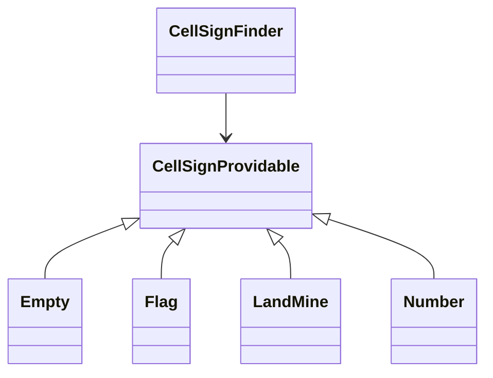

## 상속과 조합

자바에서 상속과 조합은 코드를 재사용하기 위한 방법입니다.

<br />

### 상속 (Inheritance)

부모 클래스의 속성과 메서드를 자식 클래스에서 재사용하는 것을 말합니다.

특징

- 코드 재사용 : 부모 클래스의 코드를 재사용할 수 있어 중복 코드를 줄임
- 메서드 오버라이딩 : 부모 클래스의 메서드를 자식 클래스에서 재정의 가능
- 단일 상속 : 자바는 단일 상속만 지원

<br />

### 조합 (Composition)

다른 클래스의 인스턴스를 멤버 변수로 포함하여 기능을 재사용하는 방법입니다.

특징

- 유연성 : 클래스 간 결합도가 낮아져 코드 변경에 용이
- 다중 조합 : 한 클래스에서 여러 클래스의 인스턴스를 포함

<br />

## Value Object

값을 표현하는 객체로 불변성(Immutable)과 동등성(Equality)이 특징인 객체입니다.

- 불변성
    - 한 번 생성되면 내부 데이터를 수정할 수 없음
    - final 필드, setter 금지
- 동등성
    - 서로 다른 인스턴스(메모리 주소가 달라도) 내부 값이 같다면 같은 객체로 취급
    - equals(), hashCode() 재정의 필요
- 식별자 없음
    - 식별자(ID)를 갖지 않습니다. 객체의 값 자체가 객체를 식별하는 기준이 됨

Value Object vs Entity

- Value Object
    - 값 기반의 동등성
    - 불변성
    - 식별자가 없음
- Entity
    - 식별자 기반의 동등성
    - 가변성

<br />

## 일급 컬렉션

컬렉션(List, Set, Map 등)을 그대로 사용하지 않고, 컬렉션을 감싸는 클래스로 만들어 관리하는 것을 말합니다.  
이 패턴은 컬렉션과 관련된 로직을 캡슐화하고, 도메인 의미를 명확히 표현하는 데 사용됩니다.

### 특징

- 캡슐화
    - 컬렉션과 관련된 로직을 클래스 내부에 숨기고, 외부로는 필요한 메서드만 제공
- 도메인 의미 강화
    - 컬렉션에 도메인 의미를 부여하여 더 명확하고 이해하기 쉬운 코드 작성
    - 예 : List<Student> 대신 Students 클래스르 만들어 학생 목록을 표현
- 불변성
    - 외부에서 수정하지 못하도록 불변성 보장
    - 예 : Collection.unmodifiableList()를 사용하여 읽기 전용 컬렉션 제공

### 주의할 점

- Getter로 컬렉션을 반환하지 않기
    - Collections.unmodifiableList()로 감싸서 반환
- 컬렉션을 변경하는 로직을 외부에서 수행하지 않기
    - 일급 컬렉션 내부에서 add(), remove()와 같은 메서드를 제공하는 것이 좋음

<br />

## Enum의 특성과 활용

- Enum은 상수의 집합으로 상수와 관련된 로직을 담을 수 있는 공간입니다.
- 특정 도메인 개념에 대해 그 종류와 기능을 명시적으로 표현해줄 수 있습니다.
- Enum의 변경이 잦다면 DB로 관리하는 것이 좋습니다.

<br />

## 다형성 활용하기

반복적인 if문을 단순하게 만들어 볼 수 없을까? -> 반복되는 if문 공통 구조 확인

```java
if(조건) {
    행위
}
if(조건) {
    행위
}
if(조건) {
    행위
}
```

어떤 조건을 만족하면 그 조건에 해당하는 행위를 수행한다.

- 변화하는 것 -> 구체
    - 조건
    - 행위
- 변하지 않는 것 -> 추상
    - 조건을 만족하는가?
    - 행위는 수행한다.



<br />

## 숨겨져 있는 도메인 개념 도출하기

<br />

## 키워드 정리
