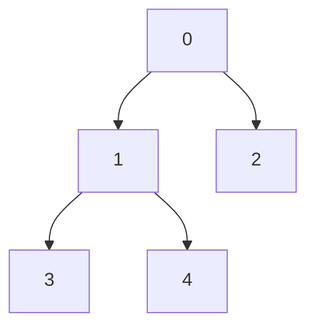

## DFS(Depth-First Search) - 깊이 우선 탐색

그래프나 트리에서 한 방향으로 끝까지 탐색한 뒤, 돌아와서 다른 경로를 탐색하는 알고리즘

<br />

### 동작 원리

1. 시작 노드에서 출발
2. 한 방향으로 갈 수 있는 곳까지 계속 진행
3. 더 이상 갈 곳이 없으면 바로 이전 단계로 되돌아감(백트래킹)
4. 아직 방문하지 않은 노드가 있으면 그 방향으로 탐색 계속

<br />

### 그래프 예제

List<List<Integer>> graph = [ [1, 2], [3, 4], [ ], [ ], [ ] ];

```text
index 0 → [1, 2] // 노드 0은 노드 1, 2와 연결
index 1 → [3, 4] // 노드 1은 노드 3, 4와 연결
index 2 → []
index 3 → []
index 4 → []
```



<br />

### DFS 템플릿 코드

```java
static List<List<Integer>> graph = new ArrayList<>();
static boolean[] visited;

@Test
void dfsAlgorithm() {
    int node = 5;
    visited = new boolean[node];

    // 노드 수만큼 그래프 초기화
    for (int i = 0; i < node; i++) {
        graph.add(new ArrayList<>());
    }

    // 간선 추가
    addEdge(0, 1);
    addEdge(0, 2);
    addEdge(1, 3);
    addEdge(1, 4);

    System.out.print("DFS 탐색 순서: ");
    dfs(0);
}

private void addEdge(int node, int linkedNode) {
    graph.get(node).add(linkedNode);
}

private void dfs(int node) {
    System.out.print(node + " -> ");
    visited[node] = true;

    for (int linkedNode : graph.get(node)) {
        if (!visited[linkedNode]) {
            dfs(linkedNode);
        }
    }
}
```