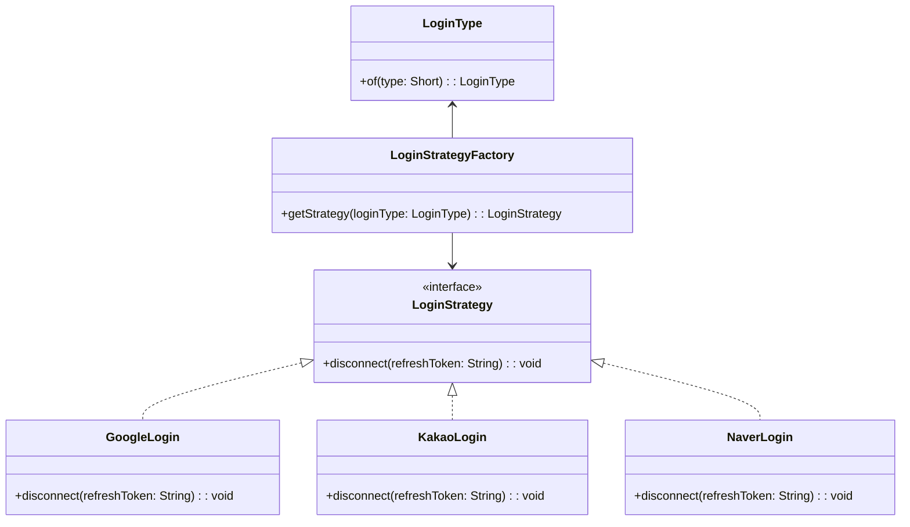

### 전략 패턴 (Strategy Pattern)

객체의 행위를 유연하게 교체하는 기술로 실행할 로직을 인터페이스로 분리하고, 필요에 따라 구현체를 바꿔 사용할 수 있도록 합니다.

<br />

### 왜 사용할까?

다음과 같은 이유로 전략 패턴을 사용합니다.

- 런타임에 알고리즘 교체
    - 특정 조건에 의해 교체된 알고리즘 수행
- 복잡한 조건문 제거
    - 반복적인 if-else문을 제거하기 위해서 사용

<br />

### 전략 패턴 적용 코드 (소셜 로그인 서비스 연결 해제)

```java

@Service
@RequiredArgsConstructor
@Transactional(readOnly = true)
public class MemberService {

    private final MemberRepository memberRepository;
    private final LoginStrategyFactory loginStrategyFactory;

    @Transactional
    public void withdrawal(Long id) {
        /* 이미 탈퇴한 회원인지 체크 */
        Member member = memberRepository.findByIdAndDeletedFalse(id)
                .orElseThrow(() -> new RuntimeException("이미 탈퇴한 회원입니다."));

        /* 회원 탈퇴 처리  */
        member.withdrawal();

        /* 소셜 로그인 서비스 연결 해제 */
        LoginType loginType = LoginType.of(member.getType()); // 로그인 타입 반환 (Enum)
        LoginStrategy loginStrategy = loginStrategyFactory.getStrategy(loginType); // 로그인 타입에 맞는 LoginStrategy 구현체 반환
        loginStrategy.disconnect(member.getRefreshToken()); // 반환된 전략 객체의 disconnect 메서드 호출 -> 연결 해제
    }
}
```



<br />

### 전략 패턴의 장단점

#### 장점

- 유연성
    - 실행 시점에 알고리즘 변경 가능
- 가독성 향상
    - 복잡하고 반복적인 조건문을 각각의 알고리즘으로 구현
- OCP 준수
    - 기존 코드를 수정하지 않고 새로운 기능(전략) 확장 가능
- 테스트 용이
    - 각 전략을 독립적으로 테스트 가능

#### 단점

- 전략 클래스가 많아짐
- 자칫하면 과도한 설계가 될 수도 있음 -> 오버 엔지니어링

<br />

### 결론

전략 패턴은 객체지향 설계 원칙을 준수하고, 유연한 시스템과 확장 가능한 구조를 구현할 수 있도록 도와주는 디자인 패턴입니다.  
반복적인 조건문이 존재하거나 런타임에 특정 조건에 따라 알고리즘을 달리 적용해야 한다면 전략 패턴을 적극 고려해 볼 시점입니다.

<br />

### 관련 코드

- https://github.com/khghouse/social-login/blob/main/src/main/java/com/login/service/MemberService.java

<br />

#### 참고 자료

- ChatGPT 대화 내용
